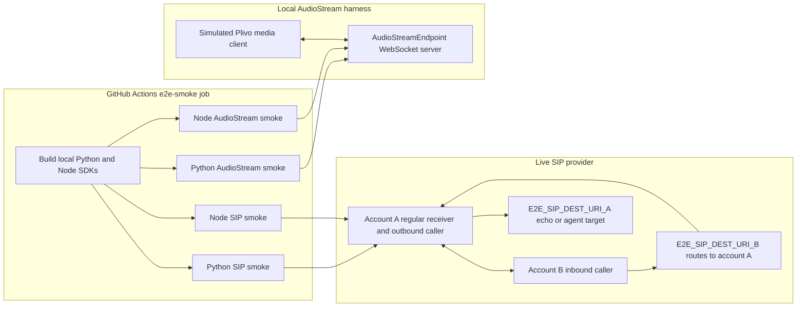

# E2E Smoke Tests

This folder contains CI-oriented e2e smoke tests that exercise the Python and
Node bindings against real transport surfaces. They are intentionally separate from
`examples/cli`: examples stay user-facing, while these scripts own CI policy,
timeouts, artifact paths, strict exit codes, and `E2E_` environment names.

## GitHub Actions Setup

The headless workflow is `.github/workflows/e2e-headless.yml`.

Required repository secrets:

- `E2E_SIP_USERNAME_A`
- `E2E_SIP_PASSWORD_A`
- `E2E_SIP_DEST_URI_A`
- `E2E_SIP_USERNAME_B`
- `E2E_SIP_PASSWORD_B`
- `E2E_SIP_DEST_URI_B`

Account A is the primary test account. The regular outbound SIP smoke registers
account A and calls `E2E_SIP_DEST_URI_A`.

Account B is the controlled inbound caller. The inbound SIP smoke registers
account A as the receiver, registers account B as the caller, and has B call
`E2E_SIP_DEST_URI_B`. Configure `E2E_SIP_DEST_URI_B` as the URI that routes to
account A.

Optional repository secrets or variables:

- `E2E_SIP_DOMAIN`, default `phone.plivo.com`
- `E2E_RUST_LOG`, default `info`

The workflow runs on:

- `workflow_dispatch`
- pull requests labeled `e2e-headless`

The workflow uses a global concurrency group because the SIP smoke is expected
to use a dedicated SIP account. Audio-stream e2e is local and runs as the hard
PR signal. Live SIP is quarantined on pull requests because carrier/provider
state can return valid failures such as busy destinations; the same SIP smoke
is a hard failure on manual runs.

## Test Setup



## Local Commands

Dry-run all scripts without network or package imports:

```bash
python e2e/headless_sip_smoke.py --dry-run --ci
python e2e/headless_sip_smoke.py --dry-run --ci --direction inbound
python e2e/audio_stream_smoke.py --dry-run --ci
node e2e/headless_sip_node_smoke.mjs --dry-run --ci
node e2e/headless_sip_node_smoke.mjs --dry-run --ci --direction inbound
node e2e/audio_stream_node_smoke.mjs --dry-run --ci
```

Run the local audio-stream matrix after installing the Python package:

```bash
python -m pip install websockets
python -m pip install ./crates/agent-transport-python
python e2e/audio_stream_smoke.py --ci --timeout-seconds 10
```

Run the Node SDK audio-stream parity smoke after building the Node package:

```bash
cd crates/agent-transport-node
bun install
bun run build
cd ../..
node e2e/audio_stream_node_smoke.mjs --ci --timeout-seconds 10
```

Run the live Python SIP smoke with credentials:

```bash
E2E_SIP_USERNAME_A=... \
E2E_SIP_PASSWORD_A=... \
E2E_SIP_DEST_URI_A=... \
python e2e/headless_sip_smoke.py --ci --output /tmp/received_audio.wav
```

Run the live Python inbound SIP smoke with two accounts:

```bash
E2E_SIP_USERNAME_A=... \
E2E_SIP_PASSWORD_A=... \
E2E_SIP_USERNAME_B=... \
E2E_SIP_PASSWORD_B=... \
E2E_SIP_DEST_URI_B=... \
python e2e/headless_sip_smoke.py \
  --ci \
  --direction inbound \
  --output /tmp/received_audio_inbound_a.wav \
  --caller-output /tmp/received_audio_inbound_b.wav
```

Run the live Node SIP smoke after building the Node package:

```bash
E2E_SIP_USERNAME_A=... \
E2E_SIP_PASSWORD_A=... \
E2E_SIP_DEST_URI_A=... \
node e2e/headless_sip_node_smoke.mjs --ci --output /tmp/received_audio_node.wav
```

Run the live Node inbound SIP smoke after building the Node package:

```bash
E2E_SIP_USERNAME_A=... \
E2E_SIP_PASSWORD_A=... \
E2E_SIP_USERNAME_B=... \
E2E_SIP_PASSWORD_B=... \
E2E_SIP_DEST_URI_B=... \
node e2e/headless_sip_node_smoke.mjs \
  --ci \
  --direction inbound \
  --output /tmp/received_audio_node_inbound_a.wav \
  --caller-output /tmp/received_audio_node_inbound_b.wav
```

## Coverage Checklist

### SIP

Covered by `headless_sip_smoke.py` and `headless_sip_node_smoke.mjs`:

- [x] Loads only `E2E_` SIP configuration in CI mode.
- [x] Uses `_A` credentials for regular outbound SIP testing.
- [x] Uses `_B` credentials as the controlled inbound SIP caller.
- [x] Registers SIP accounts through `SipEndpoint`.
- [x] Places an outbound call from account A to `E2E_SIP_DEST_URI_A`.
- [x] Places an inbound test call from account B to `E2E_SIP_DEST_URI_B`, routed to account A.
- [x] Waits for call answer with a bounded timeout.
- [x] Sends real 8 kHz mono PCM audio from a WAV fixture on outbound and inbound call legs.
- [x] Sends DTMF on the active call.
- [x] Receives media from the remote endpoint and writes WAV artifacts.
- [x] On inbound, asserts media from B to A and from A to B.
- [x] Fails on insufficient received duration or speech.
- [x] Hangs up and fails on unclean shutdown/termination paths.
- [x] Node SDK parity smoke for registration, outbound call, inbound call, RTP media send/receive, DTMF send, hangup, and shutdown.

Not covered yet:

- [ ] Deterministic local SIP registrar/dialog/RTP peer in CI.
- [ ] Multiple simultaneous SIP calls on the same endpoint/account.
- [ ] SIP redirects, re-INVITE, hold/resume, transfer, or REFER flows.
- [ ] Codec negotiation beyond the configured 8 kHz smoke path.
- [ ] NAT, packet loss, jitter, and provider failover behavior.
- [ ] Carrier-specific busy/no-answer cases as a hard PR gate.
- [ ] Full Node SIP parity across advanced SIP controls such as hold/resume, transfer, SIP INFO, recording, and beep detection.

### Audio Stream

Covered by `audio_stream_smoke.py` and `audio_stream_node_smoke.mjs`:

- [x] Local Plivo-compatible WebSocket `start` and `stop` lifecycle.
- [x] Inbound L16 8 kHz media into `AudioStreamEndpoint`.
- [x] Inbound L16 16 kHz media with endpoint-side resampling to 8 kHz.
- [x] Inbound mu-law 8 kHz media decode path.
- [x] Audio duration and speech-threshold assertions.
- [x] Inbound DTMF event handling.
- [x] Outbound `playAudio` payloads, content type, and sample rate.
- [x] Outbound flush checkpoint and `playedStream` playout acknowledgement.
- [x] `pause`, `resume`, and `clear_buffer` control messages.
- [x] Outbound `sendDTMF`.
- [x] Manual checkpoint message emission.
- [x] WebSocket disconnect cleanup and post-disconnect send failure.
- [x] Node SDK parity smoke for L16 8 kHz media, DTMF/control, playout, and cleanup.

Not covered yet:

- [ ] Real Plivo WebSocket infrastructure or webhook/auth integration.
- [ ] Multiple simultaneous audio-stream sessions.
- [ ] Long-duration calls and sustained backpressure.
- [ ] Packet loss, jitter, out-of-order media, malformed JSON, or malformed base64.
- [ ] Mute/unmute stream events.
- [ ] Background audio mixing, recording, and beep detection paths.
- [ ] Pipecat/LiveKit adapter-level behavior on top of the raw endpoint.
- [ ] Non-8 kHz pipeline sample rates and multi-channel audio.
- [ ] Full Node SDK parity across every Python matrix scenario.
